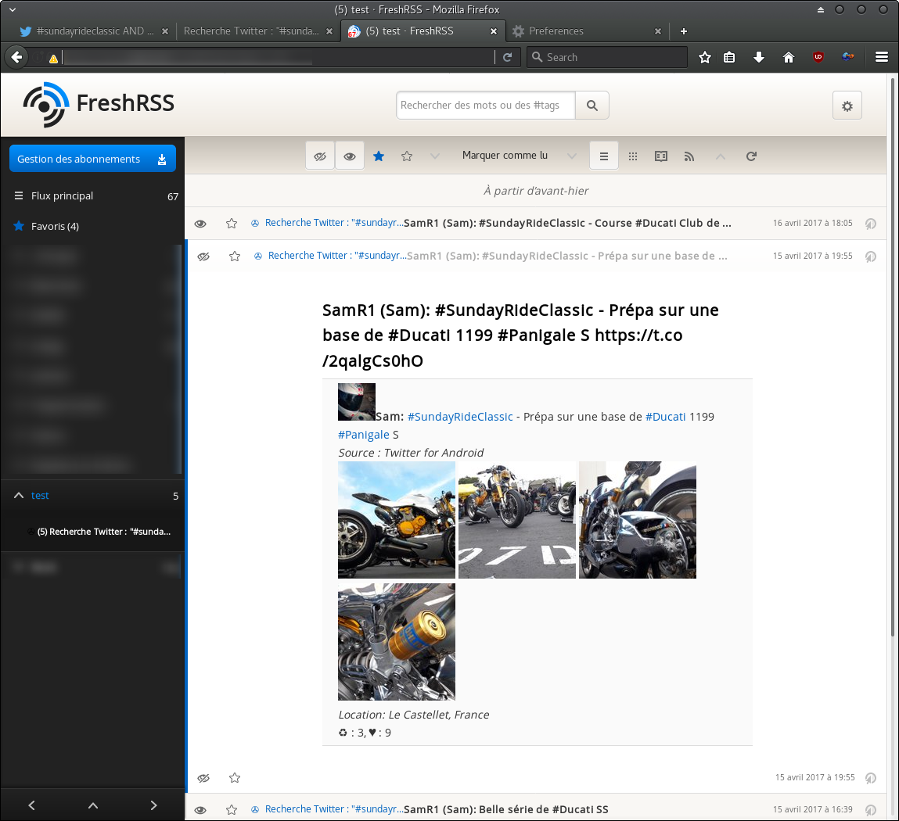

# python-twootfeed
**Python script to generate a rss feed from parsed Twitter or Mastodon search, using Flask.**  
  
The RSS feed displays only the original tweets (not the retweets) and :
- links to :  
-- the original tweet on Twitter or toot on Mastodon
-- hashtags  
-- usernames  
- URLs 
- images (only for Twitter for now)
- source  (only for Twitter for now)
- location  (only for Twitter)
- numbers of retweets (or reblogs for Mastodon) and favorites  
(see examples below).  
  
[](https://www.codacy.com/app/SamR1/python-twootfeed?utm_source=github.com&amp;utm_medium=referral&amp;utm_content=SamR1/python-twootfeed&amp;utm_campaign=Badge_Grade)
  
## **Requirements :**
- Python 3 (tested with 3.6)
- [Flask](http://flask.pocoo.org/)
- [Feedgenerator](https://pypi.python.org/pypi/feedgenerator)
- [Tweepy](https://github.com/tweepy/tweepy)
- [pytz](https://pypi.python.org/pypi/pytz/)
- [PyYAML](https://github.com/yaml/pyyaml)
- [BeautifulSoup](https://pypi.python.org/pypi/beautifulsoup4)
- [Mastodon.py](https://github.com/halcy/Mastodon.py)
- API keys Twitter and/or Mastodon 
  
  
## **Steps :**
- install Python packages : flask, BeautifulSoup, Mastodon.py, feedgenerator, tweepy, PyYAML and pytz
```bash
$ pip3 install -r requirements.txt
```

- clone this repo :
```bash
$ git clone https://github.com/SamR1/python-twootfeed.git
```

- Copy the included **config.example.yml** to **config.yml** and fill in fields for the client(s) you will use.

- API Keys
    - for **Twitter** : see https://dev.twitter.com  
    copy/paste the Twitter API key values in **config.yml.example** ('_consumerKey_' and '_consumerSecret_')
    - for **Mastodon** : see [Python wrapper for the Mastodon API](https://mastodonpy.readthedocs.io/)
      - Generate the client and user credentials manually via the [Mastodon client](https://mastodonpy.readthedocs.io/en/latest/#app-registration-and-user-authentication)
        - note that using an instance other than https://mastodon.social requires adding `api_base_url` to most method calls.
        - the file names for **client_id** and **access_token_file** go in the mastodon section of **config.yml**
      - Or use the included script (`python3 create_mastodon_client.py`) which will register your app and prompt you to log in, creating the credential files for you.

- Start the server
```bash
$ export FLASK_APP=app.py
$ python3 -m flask run --host=0.0.0.0
```

- the RSS feeds are available on these urls :  
   - for Twitter : http://localhost:5000/_keywords_ or http://localhost:5000/tweets/_keywords_
   - for Mastodon : http://localhost:5000/toots/_keywords_ and http://localhost:5000/toot_favorites

## Examples :  
### Search on Twitter :  
  

Results in RSS Feed :  
  
  
Display on FreshRSS, a great free self-hosted aggregator (https://github.com/FreshRSS/FreshRSS):    
  

### Search on Mastodon : 


Results in RSS Feed :  
 

Display on FreshRSS :
  

## **Todo :**
- [ ] handle the tweeperror "Rate limit exceeded" #2
- [ ] handle the different exceptions properly 
